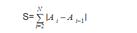

# Q1

Ramneek has some numbers with her. She loves to play with numbers. She uses two arrays A and B to arrange the numbers. 

In array A she keeps some elements,let it be, A1,A2...AN. 
And in array B she keeps some other elements, let it be, B1,B2...BN. 

There is a relationship between Ai and Bi, ∀ 1 ≤ i ≤ N, i.e., any element Ai lies between 1 and Bi.
Let the cost S of an array A be defined as:

S = Sigma ( i goes from 2 to N ) |A[i]-A[i-1]|
i.e



You have to print the largest possible value of S.

## Input Format
The first line contains, T, the number of test cases. Each test case contains an integer, N, in first line. The second line of each test case contains N integers that denote the array B.

## Constraints
```
1 ≤ T ≤ 20 
1 ≤ N ≤ 105 
1 ≤ Bi ≤ 100
```

## Output Format 
For each test case, print the required answer in one line.

## Sample Input 
```
2
5
10 1 10 1 10
1
13
```
## Sample Output 
```
36
0
```

## Explanation 
The maximum value occurs when A1=A3=A5=10 and A2=A4=1.
Second test case must return 0 as A[i-1] isn't possible.